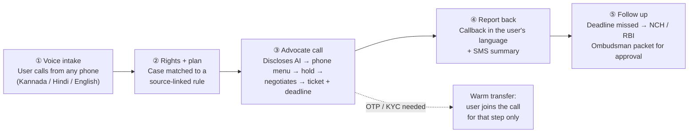
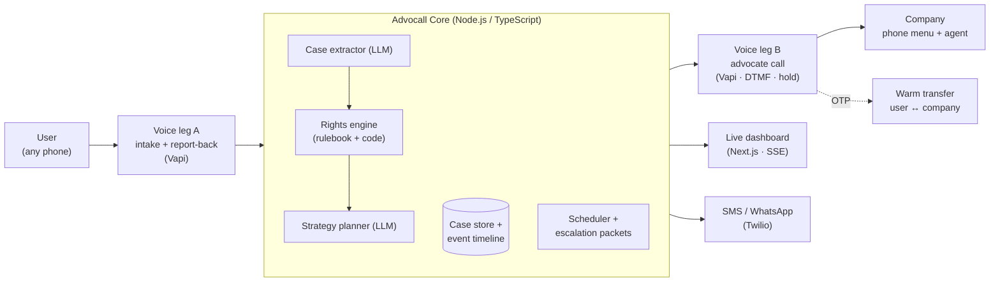

# Advocall

**Your AI advocate on every customer-care call.**

An AI voice agent that calls banks, telecom companies and e-commerce platforms for you. It waits on hold, gets through the phone menu, negotiates using the exact rule the company is bound by, and calls you back **in your own language** with the result.

`Voice-first` · `Kannada · Hindi · English` · `Works from any phone` · `Human-in-the-loop`

*Build for Billions 2026 · NITK Surathkal · Track 1: Agentic AI for Billions · Team AlgoHunters*

---

## The problem

A UPI payment fails but the money is debited. A refund never arrives. A phone bill is wrong. The only fix is a phone call with a phone menu several levels deep, a long hold, an English-heavy script, and *"please wait 7–10 working days."*

The rules already protect consumers:

- **RBI harmonised TAT rules:** a failed UPI transfer must be reversed by **T+1**, with **₹100 per day** compensation after that.
- **Consumer Protection (E-Commerce) Rules 2020, Rule 4(5):** companies must acknowledge a complaint within **48 hours** and resolve it within **one month**.

These protections only help people who know them, have time to wait on hold, and can argue fluently in English. **The gap isn't the law. It's that nobody speaks up for the customer.**

## How Advocall works

**What it sounds like:**

> **Company rep:** "Sir, the refund will come automatically. Please wait 7 to 10 working days."
>
> **Advocall:** "I understand. Under the RBI's harmonised turnaround-time rules, a failed UPI transfer should be reversed by T+1, and it's now four days past that, so ₹100 per day compensation also applies. Could you please register a formal complaint and share the reference number?"

## Key features (MVP)

| | Feature | What it does |
|---|---|---|
| ⭐ | **Rights engine** | A curated, source-linked rulebook (failed UPI/ATM, e-commerce refunds, telecom billing). Deadlines and compensation are calculated in code, not by the AI model. |
| ⭐ | **Autonomous advocate call** | Says it's an AI, navigates phone menus (DTMF), detects hold vs. a live human, pushes back politely (at most twice), captures the ticket number and reads it back to confirm. |
| ⭐ | **Warm transfer for verification** | The user joins the live call only for OTP or KYC. Advocall never hears or stores credentials. |
| ⭐ | **Follow-up & regulator escalation** | Tracks the promised deadline. If it's missed, drafts a complaint to the National Consumer Helpline or RBI Ombudsman for the user to approve. |
| | Multilingual voice intake | A regular phone number. Works from a feature phone. Asks only for missing details. |
| | Confirm-back gate | Amounts, transaction IDs, ticket numbers and dates are confirmed back. If unclear, it asks to repeat, then to spell it out, then falls back to SMS. It never guesses. |
| | Report-back call + SMS | The outcome in the user's language: ticket number, promised date, next step. |
| | Live case dashboard | Timeline, transcripts of both calls, the rule applied, and the amount at stake vs. recovered. |

## Architecture

Two voice calls, one reasoning core.

**Engineering principles**

- **Mock-first adapters:** telephony, speech, LLM, messaging and storage each sit behind an adapter with `MODE=mock|live`. The whole flow runs on test data, and switching one flag uses real services.
- **The model reasons, the code decides:** the LLM only extracts, plans and phrases. Deadlines, compensation, state changes and escalation triggers are deterministic code.
- **Grounded legal claims:** the agent cites only rules from the source-linked [rulebook](docs/RULEBOOK.md). If no rule matches, it makes no legal claim.
- **Everything is an event:** every action is written to the case timeline, which doubles as an audit trail.

## Tech stack

| Layer | Technology |
|---|---|
| Voice orchestration | Vapi (assistants, tool calls, transfers, DTMF) |
| Telephony | Twilio (PSTN numbers, SIP trunking, SMS API) |
| Speech | Sarvam AI speech models (Indian languages) · Deepgram Nova-3 (English) · ElevenLabs multilingual TTS |
| Reasoning | Claude (Anthropic API) with tool use |
| Backend | Node.js + TypeScript, REST webhooks, event-sourced case timeline |
| Data + UI | PostgreSQL · Next.js + Tailwind (server-sent events) |

## Responsible AI

- **Transparency:** every advocate call opens by saying it's an AI calling for a named customer.
- **Consent:** the user explicitly agrees during intake, and it's logged.
- **No credentials, ever:** OTP, PIN, password and CVV are never requested, heard or stored.
- **Grounded:** legal claims come only from the source-linked rulebook.
- **Polite, never threatening:** at most two push-backs, then it escalates through proper channels.
- **Human in the loop:** the user approves every filing and every settlement.

## Compared with existing tools

| Capability | Advocall | Pine AI (US) | Google "Talk to a Live Rep" | Company IVR / chatbot |
|---|:-:|:-:|:-:|:-:|
| Indian languages | ✅ | ❌ | ❌ | ◐ |
| Usable from any phone, no app | ✅ | ❌ | ❌ | ✅ |
| Calls the company and waits on hold | ✅ | ✅ | ✅ | ❌ |
| Negotiates using Indian consumer rights | ✅ | ❌ | ❌ | ❌ |
| Follows up and escalates to NCH / RBI Ombudsman | ✅ | ◐ | ❌ | ❌ |
| Works for the customer | ✅ | ✅ | ✅ | ❌ |

## Repository status

This repo holds the **design and plan** submitted for the Build for Billions 2026 screening round. Per the hackathon rules, the product code will be written during the 24-hour offline hackathon (26–27 Sep 2026).

- [`docs/ARCHITECTURE.md`](docs/ARCHITECTURE.md): call states, data model, adapters
- [`docs/RULEBOOK.md`](docs/RULEBOOK.md): the MVP rules the agent may cite, with sources
- [`docs/MVP_PLAN.md`](docs/MVP_PLAN.md): scope, demo script, 24-hour build plan

## Team AlgoHunters (NITK Surathkal)

| Member | Role |
|---|---|
| **Mohammad Rayan** | **Lead Engineer & System Architect**: conceived Advocall, designed the architecture, leads the build |
| Agastya Shiva | Team Leader: coordination and rights research |
| Yaso Sairam Karthik Abbaraju | Backend & telephony integration |
| Vaishnavi Mishra | Dashboard, UX & user research |
